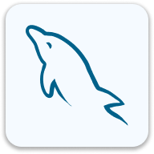

<h1 align="center">Welcome to my profile 🚀</h1>

    Greetings, my name is <b>José Alfaro</b> and I hold a technical degree in Computer Science and Information Technology from <b>CIBERTEC</b>. 
    I am currently seeking job opportunities and working on personal projects. I have knowledge in backend, frontend, mobile development, and databases.

    I am known for my leadership skills, effective collaboration in diverse environments, and ability to manage projects independently.

    

<h2>🌟 Stack:</h2>

Here are some of the skills I’ve acquired through research, study, and past projects:

<ul>
    <li>Java <b>(Spring)</b> ☕♨️</li>
    <li>C# <b>(.NET CORE, Web API)</b> #️⃣🤖</li>
    <li>SQL <b>(SQL Server, MySQL)</b> 🗃️🗄️</li>
    <li>NoSQL <b>(MongoDB, Firebase)</b> 🗃️🗂️</li>
    <li>HTML, CSS <b>(Bootstrap, Tailwind)</b> 💻🌐</li>
    <li>JavaScript, TypeScript 🟨🟦</li>
    <li>Kotlin 📱✨</li>
    <li>Version Control <b>(GitHub, GitLab)</b> 🐈‍⬛🦊</li>
    <li>System analysis 📝🏅</li>
    <li>Scrum knowledge 🔄🎯</li>
</ul>

<h2>🧰 Tools:</h2>

    Here are some of the tools I use regularly to develop, design, and manage projects, allowing me to be more productive, efficient, and collaborative:

    
    
    
    
    
    
    
    
    
    

<h2>🏹 Links:</h2>

    Connect with me through the following platforms to collaborate, network, or simply say hello:

    
    
    
    
    
    

<h2>⚡ Currently:</h2>
<ul>
    <li>Actively looking for job opportunities.</li>
    <li>Working on personal projects to expand my portfolio.</li>
    <li>Following software development online courses.</li>
    <li>Taking English lessons to improve my skills.</li>
</ul>
