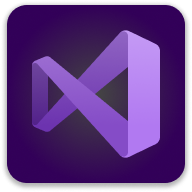
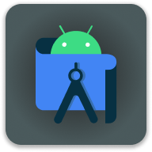
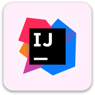
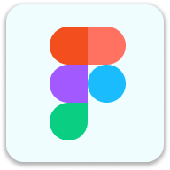

<h1 align="center">
    Welcome to my profile 🚀
</h1>

 Greetings, my name is <b>José Alfaro</b> and I hold a technical degree in Computer Science and Information Technology from <b>CIBERTEC</b>. I am currently seeking job opportunities and actively working on personal projects. I have knowledge in backend, frontend, mobile development, and databases.

I am known for my leadership skills, effective collaboration in diverse environments, and ability to manage projects independently

  <picture>
    <source media="(prefers-color-scheme: dark)" srcset="https://i.ibb.co/DLknL9R/octocat-nega-alpha.gif">
    
  </picture>

<h2>💻 Stack:</h2>

Here are some of the skills I’ve acquired through research, study, and past projects:

  <ul>
    <li>Java <b>(Spring)</b> ☕♨️</li>
    <li>C# <b>(.NET CORE, Web API)</b> #️⃣🤖</li>
    <li>SQL <b>(SQL Server, MySQL)</b> 🗃️🗄️</li>
    <li>NoSQL <b>(MongoDB, Firebase)</b> 🗃️🗂️</li>
    <li>HTML, CSS <b>(Bootstrap, Tailwind)</b> 💻🌐</li>
    <li>JavaScript, Typescript 🟨🟦</li>
    <li>Kotlin 📱✨</li>
    <li>Version Control <b>(Git, GitHub, GitLab)</b> ⏳🪄</li>
    <li>System analysis 📝🏅</li>
    <li>Scrum knowledge 🔄🎯</li>
  </ul>

<h2>🧰 Tools:</h2>

Here are some of the tools I use regularly to develop, design, and manage projects, allowing me to be more productive, efficient, and collaborative:

  
  
  
  
  
  
  
  

<h2>⚙️ Currently:</h2>
<ul>
  <li>[...]</li>
</ul>

